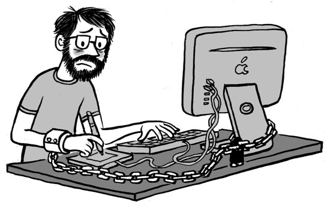

Technology is accessible to lots of humans in the world than ever before. Technology helps us to connect irrespective of where we are, work from our own home, shop all essentials online, etc., The raise of technology helped lots of people uplift their lives.

The technology that we use every day is exponentially evolving than expected. During the early nineties, if we told the people that your future self would be spending most of the time glued to a handheld screen, they wouldn’t have believed it.

But, here we are. There is a high chance that you would be reading this article on a handheld device.

Technology has become the 207th bone of the human body. It always stays with us from the moment we woke up to the moment we go to the bed. It's hard to see a person without a smartphone.

This uncontrolled exposure technology has a lot of ill effects including affecting mental health and being the primary cause of distraction.

With the constant inclusion of more tech into our life, we are losing control over technology, and technology started to control our lives.

Tech Addiction is real.

The part of the reason why it is so addictive is that the technology and platforms around it are built it to be addictive. All the companies want to spend our time with their platforms. To do this tech companies are building solutions to understand us better than ourselves. With such power tech companies can possess, we need to take a moment to think ourselves.

On the other hand, we shouldn't forget that we are also a part of the equation by letting technology into our lives without any limits.

> Technology has become one of the `fundamental elements` of this human world.

It is hard to live a life without the help of technology. But by choosing how to bend the technology for our needs we can enable it to improve our lives or deteriorate it.

It's high time that we need to take control of technology. We need to become a `Techbender`. (Got [Avatar: The Last Airbender](https://avatar.fandom.com/wiki/Avatar:_The_Last_Airbender) 🔥 💧 🌏 💨 reference here?)

The first step of becoming a Techbender is becoming `intensional` about the use of technology. Here are some ideas to improve your `TechBending` power.

### Reduce Social media

The endless feed of social media sites like Facebook, Instagram, Twitter, and endless recommendations of YouTube have helped us hooked to those platforms forever. Prolonged exposure to social media has tons of negative impacts on us.

As social media is available in the devices that are always with us, it has become our go-to tool whenever we get bored, stressed, and ended up in a rabbit hole without doing the things that we need to do. Failing to do our duties causes even more stress. As we ended up spending more time on social media, we fail to spend enough time with our loved ones. Also, we always ended up `Doomscroling`.

Reducing the consumption of social media will help us come our the hole that we dug without knowing and our loved ones will appreciate it.

Watch Netflix's documentary [The Social Dilemma](https://www.netflix.com/in/title/81254224) to learn more about the negative effects of Social Media on us.

### Reduce screen time

Think about our lives two, three, or five years before. How much time did we spend on seeing the screens in the past and how much time are we spending now?

With lots of apps on our devices, we develop a constant urge to check notifications. Thus, it becomes a primary source of distraction.

Almost all of us are doing some part of the work on screens. Being a developer, on average I spend 12 hours with a screen per day. Even if I can manage right now, it is not good in the long run.

We can avoid those distractions by keeping the devices in Do Not Disturb (DND) mode whenever we are working, spending time with our friends & family, and try to give our 100% of the attention.

Trying to get into activities, like gardening, painting, etc., that don't involve any screens will also help.

Also, try Spending at least 10 mins of a day without doing anything.

### Buy gadgets only when you need

Dozens of devices are getting released to the consumer market every year. With each iteration, devices are getting better and better.

The companies are getting creative at selling a new device with one new feature that our current device doesn't have which we would use only once during the lifetime of the device.

Before buying/upgrading any device, take a moment to think yourself if the purchase brings value to your life and helps to move forward. Buying/upgrading technologies intensionally when you need it helps both economical & environmentally friendly 😉.

---

One piece of advice regarding technology that I want to give to my 20-year self would be

> Don't focus on the Technology, instead focus on the value it brings.

Technology can be a boon or a bane depends upon how we use it. We need to remember that we have total control of the tech.

Thanks for sticking with me till here. Hope I was able to spread the idea of becoming a `TechBender` and the path to do are simple enough to follow. Let me know your thoughts on the comments section below.

If you agree with my thoughts, Feel free to share this post with your friends and loved ones.
